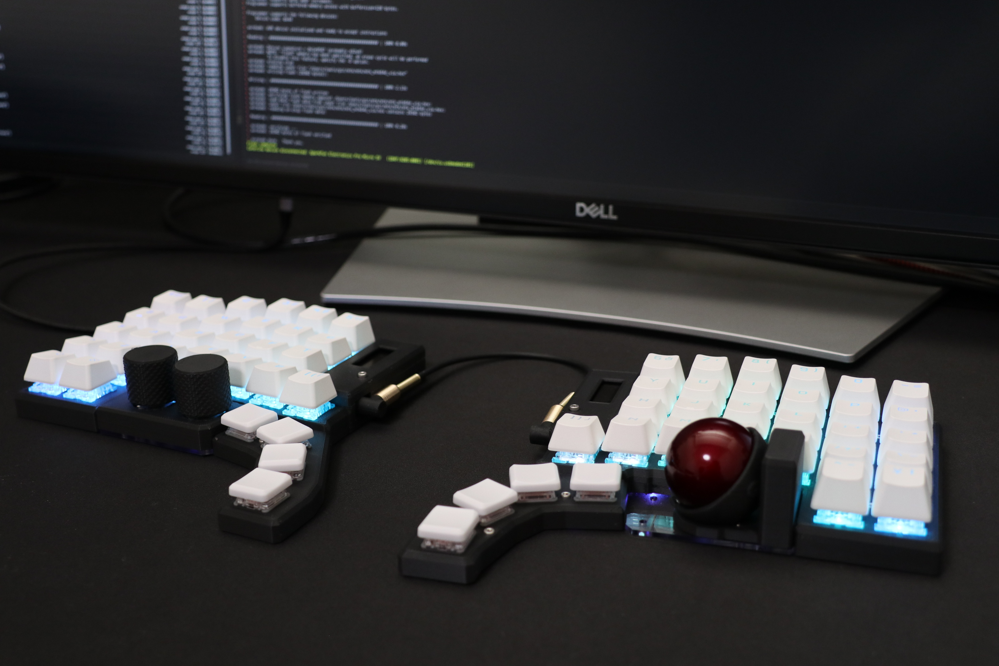
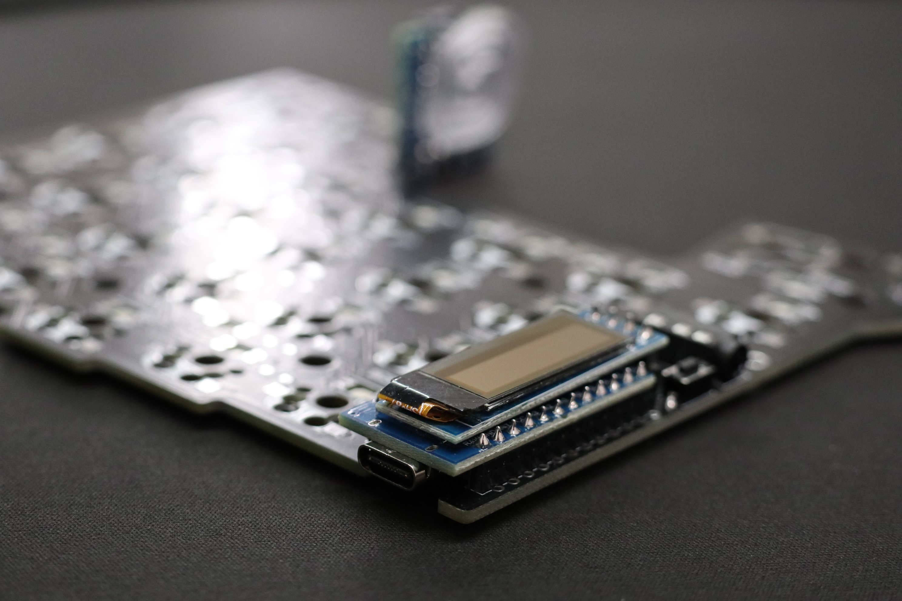

# mtk

mtk is clone keybord with trackball.


mtk64e　作成例

- キーキャップ:CORSAIR PBT DOUBLE-SHOT 交換用カラーキーキャップセット - 日本語108キー, Arctic White - CH-9911040-JP
- トラックボール：ぺリックス PERIPRO-303 GR 34 mm

　


## remap対応 ファームウェア  

!!! Remap https://remap-keys.app のアップデートにより、従来のファームウェア（qmk_firmware 0.16ベース）を使用したキーボードを接続すると、エラーメッセージが表示されマッピング変更ができません。
https://remap-keys.app をご利用の場合、qmk_firmware 0.22ベースのファームウェアをご使用ください。


### qmk_firmware 0.22ベース ファームウェア https://remap-keys.app をご使用ください

#### PMW3389センサー用
<details>

- [mtk_mtk64e_PMW3389_AutoMouseLayer_via.0.22.hex](https://raw.githubusercontent.com/mentako-ya/mtk/main/mtk/mtk_mtk64e_PMW3389_AutoMouseLayer_via.0.22.hex)
 rev3基板 PMW3389センサー　左ロータリーエンコーダー、右ボール用、自動マウスレイヤー切替

- [mtk_mtk64e_PMW3389_AutoMouseLayer_via_leftball.0.22.hex](https://raw.githubusercontent.com/mentako-ya/mtk/main/mtk/mtk_mtk64e_PMW3389_AutoMouseLayer_via_leftball.0.22.hex)
 rev3基板 PMW3389センサー　右ロータリーエンコーダー、左ボール用、自動マウスレイヤー切替

- [mtk_mtk64e_PMW3389_AutoMouseLayer_via_db.0.22.hex](https://raw.githubusercontent.com/mentako-ya/mtk/main/mtk/mtk_mtk64e_PMW3389_AutoMouseLayer_via_db.0.22.hex)
 rev3基板 PMW3389センサー　左右ボール用、自動マウスレイヤー切替

- [mtk_mtk64e_PMW3389_AutoMouseLayer_via_db.0.22.hex](https://raw.githubusercontent.com/mentako-ya/mtk/main/mtk/mtk_mtk64e_PMW3389_AutoMouseLayer_via_db.0.22.hex)
 rev3基板 PMW3389センサー　左右ボール用（Master側ポインター、Slabe側スクロール）、自動マウスレイヤー切替

- [mtk_mtk64e_PMW3389_AutoMouseLayer_via_db.0.22.hex](https://raw.githubusercontent.com/mentako-ya/mtk/main/mtk/mtk_mtk64e_PMW3389_AutoMouseLayer_via_db_noscrl.0.22.hex)
 rev3基板 PMW3389センサー　左右ボール用（両側ポインター）、自動マウスレイヤー切替

</details>

#### PMW3360センサー用
<details>

- [mtk_mtk64e_PMW3360_AutoMouseLayer_via.0.22.hex](https://raw.githubusercontent.com/mentako-ya/mtk/main/mtk/mtk_mtk64e_PMW3360_AutoMouseLayer_via.0.22.hex)
 rev2基板 PMW3389センサー　左ロータリーエンコーダー、右ボール用、自動マウスレイヤー切替

- [mtk_mtk64e_PMW3360_AutoMouseLayer_via_leftball.0.22.hex](https://raw.githubusercontent.com/mentako-ya/mtk/main/mtk/mtk_mtk64e_PMW3360_AutoMouseLayer_via_leftball.0.22.hex)
 rev2基板 PMW3389センサー　右ロータリーエンコーダー、左ボール用、自動マウスレイヤー切替

- [mtk_mtk64e_PMW3360_AutoMouseLayer_via_db.0.22.hex](https://raw.githubusercontent.com/mentako-ya/mtk/main/mtk/mtk_mtk64e_PMW3360_AutoMouseLayer_via_db.0.22.hex)
 rev2基板 PMW3389センサー　左右ボール用、自動マウスレイヤー切替

- [mtk_mtk64e_PMW3360_AutoMouseLayer_via_db.0.22.hex](https://raw.githubusercontent.com/mentako-ya/mtk/main/mtk/mtk_mtk64e_PMW3360_AutoMouseLayer_via_db.0.22.hex)
 rev2基板 PMW3389センサー　左右ボール用（Master側ポインター、Slabe側スクロール）、自動マウスレイヤー切替

- [mtk_mtk64e_PMW3360_AutoMouseLayer_via_db.0.22.hex](https://raw.githubusercontent.com/mentako-ya/mtk/main/mtk/mtk_mtk64e_PMW3360_AutoMouseLayer_via_db_noscrl.0.22.hex)
 rev2基板 PMW3389センサー　左右ボール用（両側ポインター）、自動マウスレイヤー切替

</details>

!!! qmk_firmware 0.16ベースのファームウェアでRemapをご使用の場合、旧バージョンのRemap https://qmk018.remap-keys.app をご利用ください。

### qmk_firmware 0.16ベース ファームウェア https://qmk018.remap-keys.app を使用
<details>

- [mtk_mtk64_via.hex](https://raw.githubusercontent.com/mentako-ya/mtk/main/mtk/mtk_mtk64_via.hex)
 rev1基板　右ボール/左ボール/左右ボール用
   
- [mtk_mtk64e_via.hex](https://raw.githubusercontent.com/mentako-ya/mtk/main/mtk/mtk_mtk64e_via.hex)
 rev2基板 PMW3360センサー　左ロータリーエンコーダー、右ボール用

- [mtk_mtk64e_left_ball_via.hex](https://raw.githubusercontent.com/mentako-ya/mtk/main/mtk/mtk_mtk64e_left_ball_via.hex)
 rev2基板 PMW3360センサー　右ロータリーエンコーダー、左ボール用
   
- [mtk_mtk64e_AutoMouseLayer_via.hex](https://raw.githubusercontent.com/mentako-ya/mtk/main/mtk/mtk_mtk64e_AutoMouseLayer_via.hex)
 rev2基板 PMW3360センサー　左ロータリーエンコーダー、右ボール用、自動マウスレイヤー切替

- [mtk_mtk64e_AutoMouseLayer_via_db.hex](https://raw.githubusercontent.com/mentako-ya/mtk/main/mtk/mtk_mtk64e_AutoMouseLayer_via_db.hex)
 rev2基板 PMW3360センサー　左右ボール用（Master側ポインター、Slabe側スクロール）、自動マウスレイヤー切替

- [mtk_mtk64e_AutoMouseLayer_via_db_noscrl.hex](https://raw.githubusercontent.com/mentako-ya/mtk/main/mtk/mtk_mtk64e_AutoMouseLayer_via_db_noscrl.hex)
 rev2基板 PMW3360センサー　左右ボール用（両側ポインター）、自動マウスレイヤー切替
   
- [mtk_mtk64e_AutoMouseLayer_via_leftball.hex](https://raw.githubusercontent.com/mentako-ya/mtk/main/mtk/mtk_mtk64e_AutoMouseLayer_via_leftball.hex)
 rev2基板　右ロータリーエンコーダー、左ボール用、自動マウスレイヤー切替

- [mtk_mtk64e_PMW3389_AutoMouseLayer_via.hex](https://raw.githubusercontent.com/mentako-ya/mtk/main/mtk/mtk_mtk64e_PMW3389_AutoMouseLayer_via.hex)
 rev3基板 PMW3389センサー　左ロータリーエンコーダー、右ボール用、自動マウスレイヤー切替

</details>

## remap用 via.json

- [mtk64_rb_via.json](https://raw.githubusercontent.com/mentako-ya/mtk/main/mtk/mtk64_rb_via.json)     rev1 mtk64　右ボール用 
    
- [mtk64_db_via.json](https://raw.githubusercontent.com/mentako-ya/mtk/main/mtk/mtk64_db_via.json)  rev1 mtk64　左右ボール用 
    
- [mtk64e_via.json](https://raw.githubusercontent.com/mentako-ya/mtk/main/mtk/mtk64e_via.json)      rev2,rev3 mtk64e　ロータリーエンコーダー＆ボール、左右ボール用

## ご自身でファームウェアをカスタマイズ、ビルドする場合 

   [via firmware ビルドガイド](qmk_firmware/keyboards/mtk/)


## 更新情報

<details>

### ファームウェアが　qmk_firmware 0.22 ベースになりました
   ファームウェアを　qmk_firmware 0.22 ベースに更新しました。
   
   Remap [https://remap-keys.app] のアップデートに対応しました。

### トラックボールセンサーをPMW3389に更新しました
   トラックボールセンサーをより高性能なPMW3389DM-T3QUに更新しました。
   
   [PMW3360DM-T2QUとPMW3389DM-T3QUの比較](https://www.pixart.com/products-comparison/7/Optical_Mouse_Sensor)
   
   ファームウェアはPMW3389センサー用になります。
   
   従来のPMW3360センサーを使用したキーボードをご使用の場合、ファームウェアはPMW3360センサー用をご使用ください。
   
### 右ロータリーエンコーダー、左ボール用、自動マウスレイヤー切替有効　ファームウェアを追加しました

   [mtk_mtk64e_AutoMouseLayer_via_leftball.hex](https://raw.githubusercontent.com/mentako-ya/mtk/main/mtk/mtk_mtk64e_AutoMouseLayer_via_leftball.hex) rev2基板用　右ロータリーエンコーダー、左ボール用、自動マウスレイヤー切替

   ソースコード : https://github.com/mentako-ya/mtk/tree/mtk64e_leftball

### ファームウェアを再ビルドしました
   [mtk_mtk64e_AutoMouseLayer_via.hex](https://raw.githubusercontent.com/mentako-ya/mtk/main/mtk/mtk_mtk64e_AutoMouseLayer_via.hex) rev2基板用　左ロータリーエンコーダー、右ボール用、自動マウスレイヤー切替

   [mtk_mtk64e_AutoMouseLayer_via_db.hex](https://raw.githubusercontent.com/mentako-ya/mtk/main/mtk/mtk_mtk64e_AutoMouseLayer_via_db.hex) rev2基板用　左右ボール用（Master側ポインター、Slabe側スクロール）、自動マウスレイヤー切替

   [mtk_mtk64e_AutoMouseLayer_via_db_noscrl.hex](https://raw.githubusercontent.com/mentako-ya/mtk/main/mtk/mtk_mtk64e_AutoMouseLayer_via_db_noscrl.hex) rev2基板用　左右ボール用（両側ポインター）、自動マウスレイヤー切替
   
   qmk_firmwareのバージョン不整合により、キーボード接続時に初期化処理が正しく動作しない場合があったため、qmk_firmware 0.16.3 で再ビルドしました。
   再ビルドによりレイヤー３のカスタムキーコードが変わりました。ファームウェア更新した場合、キーマップをリセットするか、新しいキーコードとの対応を確認してキーマッピングを修正してください。
　
### オーディオ制御とシステム制御キーを有効化しました
   [mtk_mtk64e_AutoMouseLayer_via.hex](https://raw.githubusercontent.com/mentako-ya/mtk/main/mtk/mtk_mtk64e_AutoMouseLayer_via.hex)
   
   ご自身でファームウェアをビルドする場合、[rules.mk](https://github.com/mentako-ya/mtk/blob/cd9f4ba413dade68378f4804782a1528e7ef739e/qmk_firmware/keyboards/mtk/mtk64e/rules.mk#L12)の
   ```EXTRAKEY_ENABLE = no        # Audio control and System control```
   をyesに修正してください。
   
   ファームウェアのサイズが上限に近いため、有効化している機能の組み合わせによっては、ファイル容量オーバーによりビルドできない場合があります。

### 左右ボール用ファームウェアを追加しました。
   [mtk_mtk64e_AutoMouseLayer_via_db.hex](https://raw.githubusercontent.com/mentako-ya/mtk/main/mtk/mtk_mtk64e_AutoMouseLayer_via_db.hex) rev2基板用　左右ボール用（Master側ポインター、Slabe側スクロール）、自動マウスレイヤー切替
   [mtk_mtk64e_AutoMouseLayer_via_db_noscrl.hex](https://raw.githubusercontent.com/mentako-ya/mtk/main/mtk/mtk_mtk64e_AutoMouseLayer_via_db_noscrl.hex) rev2基板用　左右ボール用（両側ポインター）、自動マウスレイヤー切替

### 意図せずマウスレイヤー２が解除されてしまうバグに対応しました。
自動でマウスレイヤーに切り替わっている間に手動でレイヤー２に切り替えると、一定時間経過後にレイヤー２が解除されるバグに対応しました。

### エンコーダーの解像度を調整しました。
[エンコーダーの仕様](https://tech.alpsalpine.com/j/products/detail/EC11E18244AU/#ancFig3)に合わせて、'ENCODER_RESOLUTION 4 → 2' に調整しました。

### 自動マウスレイヤーから元のレイヤーに戻る時間を0.1秒単位で調整可能にしました。
調整用カスタムキーコード
- KC_TO_RESET_INC　0x5DB2
- KC_TO_RESET_DEC　0x5DB3

### トラックボール操作時に自動でマウスレイヤー2に切り替わる対応を追加しました。
[takashicompanyさんの実装](https://zenn.dev/takashicompany/articles/69b87160cda4b9)を参考にしています。

[mtk_mtk64e_AutoMouseLayer_via.hex](https://raw.githubusercontent.com/mentako-ya/mtk/main/mtk/mtk_mtk64e_AutoMouseLayer_via.hex)

※容量の都合でこちらのファームウェアはLEDエフェクトを省略しています。（LEDのOn/Off、色と明るさ調整は可能、点滅やグラデーションは不可）
LEDエフェクトが必要な場合、従来のファームウェアをご利用ください。

### 通電直後のエンコーダー誤作動対応を追加しました。

### バックプレートが透明アクリル製になりました。
バックプレート固定用の低頭6角穴付きボルトの付け外しには[T5サイズのレンチ](https://amzn.asia/d/b8Xeegc)を使用します。

### メインの基板が黒色になりました。

### 親指のロープロファイルキーの向きを内向きに変更しました。
[MCC-profile POM Choc keycap](https://shop.yushakobo.jp/products/3694)のような、シリンドリカル（円柱状に凹んでいる形状）のキーを使用できます。

[MBK Choc Low-Profile Keycaps](https://shop.yushakobo.jp/products/mbk-choc-low-profile-keycaps)のような、スフィリカル（お椀状に凹んでいる形状）のキーでは手前側の角が親指に当たって痛くなってしまう方におすすめです。
</details>

## キーボードの接続

まず、動作確認のために、右左の各キーボードを単体でPCに接続し、キー入力が可能であること、OLEDにキーボードの情報が表示されることを確認してください。

（OLEDは一定時間操作しないと消灯します）

接続時にキー入力できない場合、OLEDに何も表示されない場合、ロゴが表示されていてキー情報（数値やコード）が表示されない場合は、OLEDの斜め下にあるリセットボタン（ボルトの頭）をプッシュするか、キーボードを接続し直してください。

動作しない場合は、プロマイクロのコンスルーが抜けかけている、回路がショートしていて起動できない（LEDの取り付け方向間違いでこの状態になることが多いです）などのハードウェアの問題か、ファームウェアが消えているなどのソフトウェアの問題が考えられます。

USB接続時にプロマイクロ裏側の赤いランプが点灯しているか、USB端子の隙間から確認してください。

赤いLEDが点灯していない場合、点灯してもすぐ消えてしまう場合ば、ハードウェアの問題です。

左右単体で動作確認できたら、TRSケーブルで左右を接続し、どちらか一方のUSB端子をPCに接続してください。

左右を繋ぐと動作しない場合、TRSケーブルが奥まできちんと刺さっていないか、TRSケーブルの断線、接触不良が考えられます。

TRSケーブルは、ケーブル付け根が本体のケースの中まで入り込む設計です。ねじ込むようにしてしっかり奥まで差し込んでください。


## キーマップ変更

キーマップの変更はChromeブラウザを使用して、https://remap-keys.app　で変更します。

（旧バージョンのqmk_firmware 0.16ベースのファームウエアをご使用の場合、https://qmk018.remap-keys.app　で変更します。）

下記に本キーボードを使用する際に最低限必要な手順を記載します。

remapの一般的な使用方法はサリチル酸さんの記事などをご参照ください。

　https://salicylic-acid3.hatenablog.com/entry/remap-manual

1. [START REMAP FOR YOUR KEYBORD]　をクリック


2. [+ KEYBORD]をクリック


3. [mtk64] か。[mtk64e]を選択して接続.


4. Jsonファイルのアップロードを求められるので、下記からレイアウトに合わせたjsonファイルをダウンロードして使用する


- mtk64 右ボール用 [mtk64_rb_via.json](https://raw.githubusercontent.com/mentako-ya/mtk/main/mtk/mtk64_rb_via.json)
- mtk64 左右ボール用 [mtk64_db_via.json](https://raw.githubusercontent.com/mentako-ya/mtk/main/mtk/mtk64_db_via.json)
- mtk64e ロータリーエンコーダー＆ボール、両側ボール用 [mtk64e_via.json](https://raw.githubusercontent.com/mentako-ya/mtk/main/mtk/mtk64e_via.json)

5. キーマップの変更 / キーマップの書き込み（右上Flashボタン） /　変更したキーマップの保存　/　キーマップのPDFダウンロード　などが可能

右ボール　キーマップサンプル

- via keyleyout(right ball) [mtk64_rb_via.json](https://raw.githubusercontent.com/mentako-ya/mtk/main/mtk/mtk64_rb_via.json)
- sample keymap cheetsheet(right ball) [mtk64_rb_keymap_cheatsheet.pdf](mtk/mtk64_rb_keymap_cheatsheet.pdf)


左右ボール　キーマップサンプル

- via keyleyout(double ball) [mtk64_db_via.json](https://raw.githubusercontent.com/mentako-ya/mtk/main/mtk/mtk64_db_via.json)
- sample keymap cheetsheet(double ball) [mtk64_db_keymap_cheatsheet.pdf](mtk/mtk64_db_keymap_cheatsheet.pdf)


mtk64e ロータリーエンコーダー＆ボール、左右ボール　キーマップサンプル

- via keyleyout(rotary encoder) [mtk64e_via.json](https://raw.githubusercontent.com/mentako-ya/mtk/main/mtk/mtk64e_via.json)
- sample keymap cheetsheet(rotary encoder) [mtk64e_keymap_cheatsheet.pdf](mtk/mtk64e_keymap_cheatsheet.pdf)
- sample keymap cheetsheet(rotary encoder) [mtk64e_AutoMouseLayer_keymap_cheatsheet.pdf](mtk/mtk64e_AutoMouseLayer_keymap_cheatsheet.pdf)


※ 製品出荷時点でキーボードに設定済みのマッピングは、ファームウェアのデフォルトキーマッピングとは一部異なる場合があります。

キーマップのリセットや、キーボードの初期化を行うと、キーマップはファームウェアのデフォルトキーマップにリセットされます。

キーマップ変更やリセットを行う前に、初期のマッピングの状態でマップの保存をお勧めします。


## ファームウェア更新
[Pro Micro Web Updater](https://sekigon-gonnoc.github.io/promicro-web-updater/index.html) を使用してファームウェアを更新できます。

出荷時に書き込まれているファームウェアは[mtk_mtk64e_AutoMouseLayer_via.hex](https://raw.githubusercontent.com/mentako-ya/mtk/main/mtk/mtk_mtk64e_AutoMouseLayer_via.hex)になります。　

[Pro Micro Web Updater](https://sekigon-gonnoc.github.io/promicro-web-updater/index.html) にアクセスし、事前にダウンロードしたファームウェアをアップロードします。

キーボードの左右どちらか一方をUSB接続し、画面上の[flash]ボタンを押下します。

シリアルポートへの接続要求のウインドウが表示されるので、OLED斜め下のリセットスイッチ（ボルトの頭）を２回連続でクリックします。

シリアルポートの一覧に「Pro Micro 5v」が表示されるので、選択して接続ボタンを押下します。


## 基本的な使用方法

本キーボードは、レイヤー０〜3の４種類のキーマップを切り替えて使用します。

レイヤーの切り替えは左手親指キーのHOLD（シフトキーのように押したままにすること）に割り当てられており、左端からLayer(1),Layer(2),Layer(3)が設定されています。

- レイヤー０:通常のアルファベット入力
- レイヤー１:Shiftキー押下相当（大文字入力や記号入力）
- レイヤー２:右手のキーがマウスのボタンに切り替わる
- レイヤー３:トラックボールがスクロールモードに切り替わる、キースイッチはLEDの調整、トラックボールの速度、スクロールの速度調整

自動マウスレイヤー切替に対応したファームウェアでは、トラックボールを一定距離動かすと自動的にレイヤー2に切り替わり、マウスボタンクリックが可能になります。
デフォルトでは１秒間何も操作しないとレイヤー0に戻ります。
自動マウスレイヤー切替機能がOnの場合、OLED３行目が反転表示されます。
（レイヤー３左側のキーボード最下段左から２番目のキーで自動切替機能On／Off）


## レイヤー３トラックボール設定のコード値
レイヤー３にマッピングされているキーのうち、トラックボールの設定を行うキーは、のカスタムコードで設定します。
Remapでは User0 ~（旧バージョンRemapでは16進数）で設定します。

コード値については下記の表を参照してください。

- RemapのUserキー:旧バージョンRemapの16進コード:keymap.cのカスタムコード　

### レイヤー３トラックボール設定のコード値　mtk64　（mtk_mtk64_via.hex/mtk_mtk64e_via.hex）
- User 0:0x5DA5:KBC_RST    トラックボール設定リセット
- User 1:0x5DA6:KBC_SAVE   トラックボール設定保存（次回接続時にトラックボール設定が保存された値になっている）
- User 2:0x5DA7:CPI_I100   トラックボールのカーソル速度 +100
- User 3:0x5DA8:CPI_D100   トラックボールのカーソル速度 -100
- User 4:0x5DA9:CPI_I1K    トラックボールのカーソル速度  +1000
- User 5:0x5DAA:CPI_D1K    トラックボールのカーソル速度 -1000
- User 6:0x5DAB:SCRL_TO    トラックボールのスクロールモードOn/Off
- User 7:0x5DAC:SCRL_MO    トラックボールのスクロールモードOn
- User 8:0x5DAD:SCRL_DVI   トラックボールのスクロール速度を下げる
- User 9:0x5DAE:SCRL_DVD   トラックボールのスクロール速度を上げる

### レイヤー３トラックボール設定のコード値　mtk64e自動マウスレイヤー　（mtk_mtk64e_AutoMouseLayer_via.0.22.hex）
- User 0:0x5DB1:KBC_RST    トラックボール設定リセット
- User 1:0x5DB2:KBC_SAVE   トラックボール設定保存（次回接続時にトラックボール設定が保存された値になっている）
- User 2:0x5DB3:CPI_I100   トラックボールのカーソル速度 +100
- User 3:0x5DB4:CPI_D100   トラックボールのカーソル速度 -100
- User 4:0x5DB5:CPI_I1K    トラックボールのカーソル速度 +1000
- User 5:0x5DB6:CPI_D1K    トラックボールのカーソル速度 -1000
- User 6:0x5DB7:SCRL_TO    トラックボールのスクロールモードOn/Off
- User 7:0x5DB8:SCRL_MO    トラックボールのスクロールモードOn
- User 8:0x5DB9:SCRL_DVI   トラックボールのスクロール速度を下げる
- User 9:0x5DBA:SCRL_DVD   トラックボールのスクロール速度を上げる

### レイヤー３自動マウスレイヤー切替設定のコード値　mtk64e自動マウスレイヤー　（mtk_mtk64e_AutoMouseLayer_via.0.22.hex）
- User10:0x5DBB:KC_TG_CLICKABLE     自動マウスレイヤー切替On/Off (有効時にOLEDを反転表示）
- User11:0x5DBC:KC_TO_CLICKABLE_INC 自動マウスレイヤー切替距離 +
- User12:0x5DBD:KC_TO_CLICKABLE_DEC 自動マウスレイヤー切替距離 -
- User13:0x5DBE:KC_TO_RESET_INC     自動マウスレイヤーから元のレイヤーに戻る時間 + 0.1秒
- User14:0x5DBF:KC_TO_RESET_DEC.    自動マウスレイヤーから元のレイヤーに戻る時間 - 0.1秒
 
## 左右トラックボール構成の動作

[mtk_mtk64e_AutoMouseLayer_via_db.hex](https://raw.githubusercontent.com/mentako-ya/mtk/main/mtk/mtk_mtk64e_AutoMouseLayer_via_db.hex) を使用するとUSBケーブルを挿した側（Master)がポインター操作、反対側（Slave）がスクロール操作（上下左右）になります。
レイヤー３に切り替えた際に左右のモードが入れ替わります。

[mtk_mtk64e_AutoMouseLayer_via_db_noscrl.hex](https://raw.githubusercontent.com/mentako-ya/mtk/main/mtk/mtk_mtk64e_AutoMouseLayer_via_db_noscrl.hex) を使用するとMaster側Slave側ともポインター操作になります。
レイヤー３に切り替えた際に左右ともスクロールになります。

## トラックボールのお手入れ
ボールとボールケースの白い支持球はこまめに掃除していただくと、滑りがよくなり快適に使用できます。

白い支持球周辺に埃が溜まりますので、時々ボールを外してメガネ拭きなどで掃除してください。
ボールの滑りが悪いと、狙ったところをカーソルが飛び越してしまい、使いづらくなります。

ボールに[シリコンスプレー](https://amzn.asia/d/2fwdtvX)を少量塗布して、ティッシュ、メガネ拭き、[キムワイプ](https://www.amazon.co.jp/dp/B001EHI9XI)などで軽く拭っていただくと、滑りが良くなり、操作性が向上します。

定期的にシリコンを塗布する必要がありますが、シリコンスプレーは1本あれば数年使用できます。
